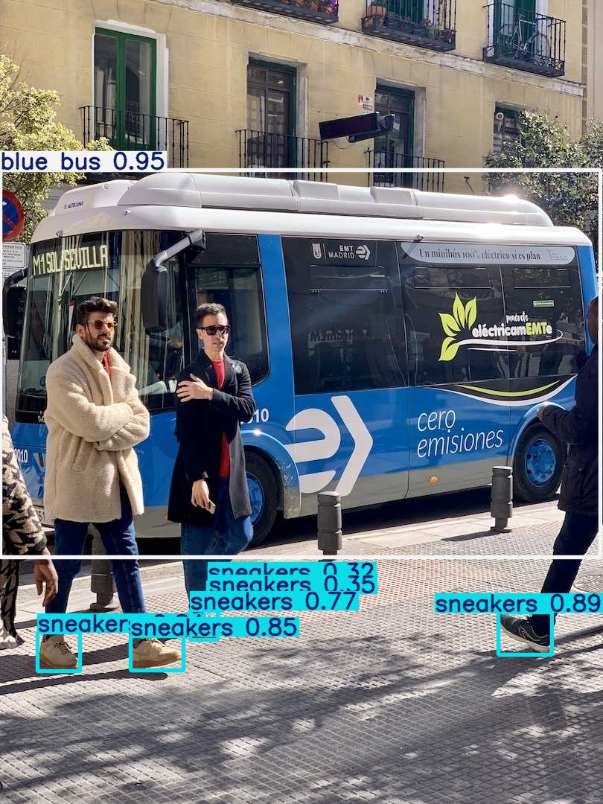

# YoloStack

YoloStack is a minimal replacement for the DeepStack AI Server (which seems not do be developed anymore :( ).

It is limited to the ```predict```-endpoint only. It is tailored for use with [Frigate](https://frigate.video/). It for now only uses the [YOLOv8x-worldv2](https://docs.ultralytics.com/models/yolo-world/#available-models-supported-tasks-and-operating-modes) model.

## Use with Frigate

The easiest way is to run YoloStack alongside [Frigate](https://frigate.video/) from a docker-compose.yaml. This could look something like:

```
version: "3.9"

services:
  yolostack:
    image: ghcr.io/hoeflechner/yolostack:latest
    container_name: yolostack
    restart: unless-stopped
    volumes:
      # mount frigates config file here!
      - ./config/config.yaml:/workspace/config.yaml:ro
    environment:
      # currently onnx, openvino and ultralytics is supported
      - FORMAT=ultralytics
      # choose a model from https://docs.ultralytics.com/models/yolo-world/
      - MODELNAME=yolov8x-worldv2
    deploy:
      resources:
        reservations:
          devices:
            - driver: nvidia
              count: 1
              capabilities: [gpu]

  frigate:
    restart: unless-stopped
    container_name: frigate
    privileged: true # this may not be necessary for all setups
    restart: unless-stopped
    image: ghcr.io/blakeblackshear/frigate:stable-tensorrt
    shm_size: "64mb" # update for your cameras based on calculation above
    volumes:
      - ./config:/config
    ports:
      - "5000:5000"
    deploy:
      resources:
        reservations:
          devices:
            - driver: nvidia
              count: all
              capabilities: [gpu]
```

Please note, that YoloStack is provided the same configuration file as Frigate. YoloStack will read all labels frigate is configured for and tries to predict them! Frigate is no longer limited to labels from the [coco dataset](https://cocodataset.org/#explore)!

In Frigates configuration set the detector to [deepstack](https://docs.frigate.video/configuration/object_detectors/#deepstack--codeprojectai-server-detector)
and point it to YoloStack:

```
detectors:
  deepstack:
    api_url: http://yolostack:4000/predict
    type: deepstack
    api_timeout: 0.1
```

## Hardware

Hardware acceleration is recommended with the model. Nvidia-Gpus can be used inside docker: https://docs.nvidia.com/datacenter/cloud-native/container-toolkit/latest/install-guide.html 
The Model will also use quite some vram (2.5-3Gb)

### Reducing VRAM Usage

You can reduce VRAM consumption via the `QUANTIZE` environment variable:

| `FORMAT` | `QUANTIZE` | Effect |
|---|---|---|
| `ultralytics` | `fp16` (default) | PyTorch FP16 inference (~50% less VRAM) |
| `onnx` | `fp16` | ONNX export with FP16 weights |
| `onnx` | `int8` | ONNX dynamic INT8 quantization (~75% less) |
| `openvino` | `int8` | OpenVINO INT8 quantization (~75% less) |
| `tensorrt` | `fp16` | TensorRT FP16 engine (~50% less + faster) |
| `tensorrt` | `int8` | TensorRT INT8 engine (~75% less + fastest) |

Example:

```
environment:
  - FORMAT=tensorrt
  - QUANTIZE=int8
```

## Configuration and standalone Usage

Provide the labels you want to track in the config.yaml file:

```
track:
- man 
- sneakers
```

Note that these labels are not part of the coco dataset. Any label can be used (see [yolo-world](https://docs.ultralytics.com/models/yolo-world/#set-prompts))

### Custom Classes per Request

When using `FORMAT=ultralytics`, you can override the detection classes per request by passing a `classes` parameter. This dynamically generates new CLIP text embeddings for the specified classes.

```bash
# Comma-separated
curl -X POST -F "image=@photo.jpg" -F "classes=dog,cat,bird" http://localhost:4000/predict

# JSON array
curl -X POST -F "image=@photo.jpg" -F 'classes=["dog","cat","bird"]' http://localhost:4000/predict

# As query parameter
curl -X POST -F "image=@photo.jpg" "http://localhost:4000/predict?classes=dog,cat,bird"
```

If `classes` is omitted, the default labels from `config.yaml` are used. Note: custom classes only work with the native YOLOWorld model (`FORMAT=ultralytics`), not with exported ONNX/TensorRT/OpenVINO models where classes are baked in at export time.

install dependencies and run:

```
pip install -r requirements.txt
python app.py
```

in another terminal test the endpoint:

```
python test.py
```

it should return a json string with the predictions it found in the image.



## Docker

It is ment to be run as a docker container. See [docker-compose.yml](https://github.com/hoeflechner/yolostack/blob/main/docker-compose.yml)


